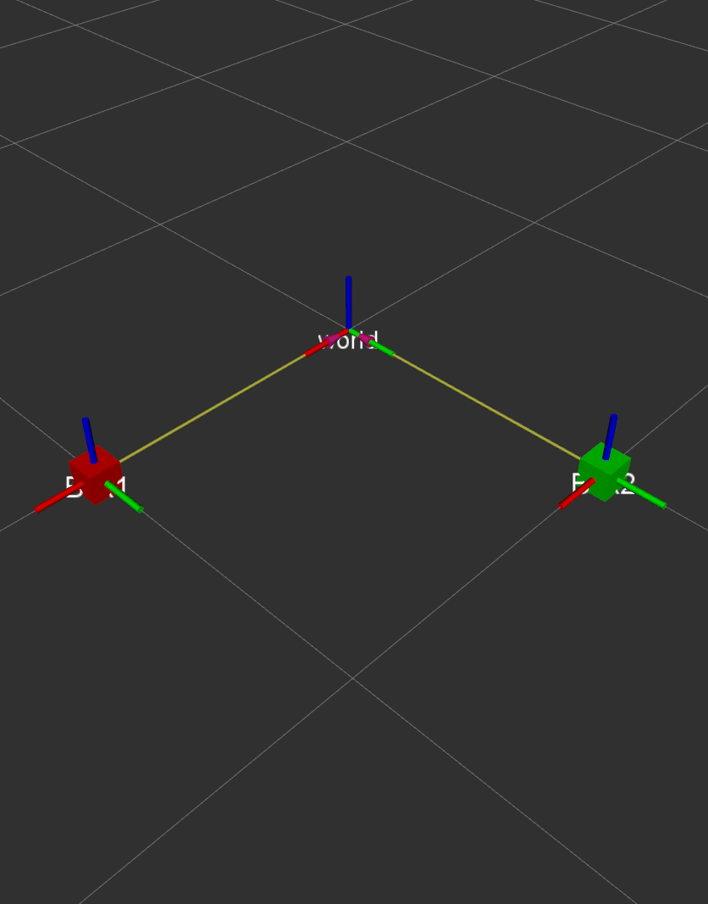

# object_tf_publisher

## Overview

This is object TF and marker publisher that make the data read objects info from environmental_memory.

## Usage

Run the main node standalone with

	rosrun object_tf_publisher object_tf_publisher_node.py

## Bugs & Feature Requests

Please report bugs and request features using the [Issue Tracker](https://github.com/mhri/mhri_tools/issues).
