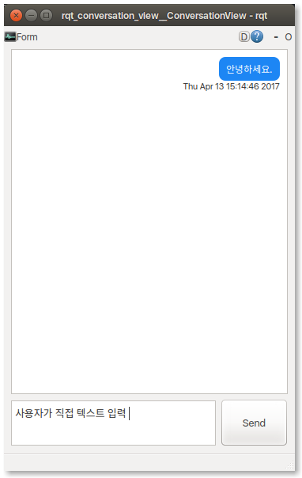

# rqt_conversation_view

## Overview

This is rqt_plugin named rqt_conversation_view that used to input text directly instead of speech recognition.

## Usage

Run the main node standalone with

	rqt --standalone rqt_conversation_view

## Bugs & Feature Requests

    Please report bugs and request features using the [Issue Tracker](https://github.com/mhri/mhri_tools/issues).
